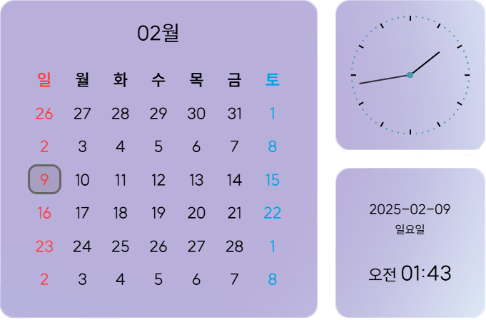

# MilliUlsan

 

 
 
<!-- react -->
 
<!-- nodejs -->

<!-- express -->

<!-- recoil -->

## MilliUlsan - 울산 정보 조회

-   울산의 여러가지 정보를 제공하는 홈페이지입니다.
-   축제, 병원, 문화, 영화 등의 정보를 제공하고 있습니다.
-   날씨, 날짜, 시간 등의 기본 정보도 함께 제공합니다.
-   메인페이지의 기능들을 원하는 대로 빼거나 더하여 사용할 수 있습니다.
-   다크모드를 지원합니다.
     

## 프로젝트 간단 소개

-   React로 개발했으며 서버는 express.js로 개발했습니다.
    **👉 서버 링크** 
    
    
-   공공데이터포털, 기상청, OpenWeatherMap의 API를 활용했습니다.
-   컴포넌트를 조립하는 형태로 메인페이지의 모듈들을 원하는 대로 빼거나 더하여 사용할 수 있습니다.
-   사용자가 선택한 지역 혹은 카테고리 종류는 Recoil로 관리했습니다.
-   styled-components로 글로벌 스타일(테마)을 관리하고 라이트/다크모드를 지원합니다.
     

## 화면 구성

### 메인 화면

### 병원 시설 조회 및 검색 (다크모드)

### 태블릿/모바일 환경

